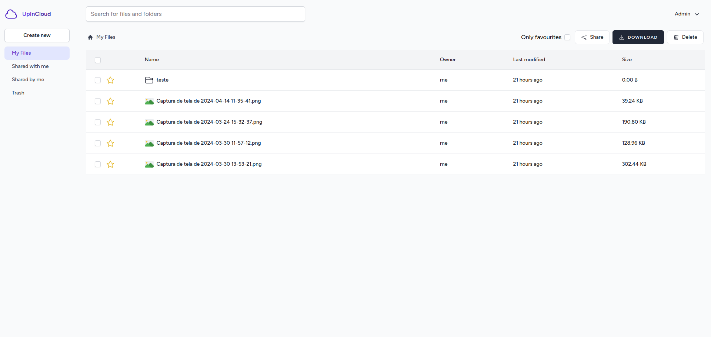

# Cloud de arquivos

Aplicação similar ao google drive feita com Laravel 11 e Vue 3.

Possui funcionalidades como:
- Criação de pastas multinível
- Upload de arquivos e pastas
- Deletar e baixar arquivos/pastas
- Pesquisar por arquivos/pastas
- Compartilhar arquivos/pastas com outros usuários
- Upload de arquivos para bucket

